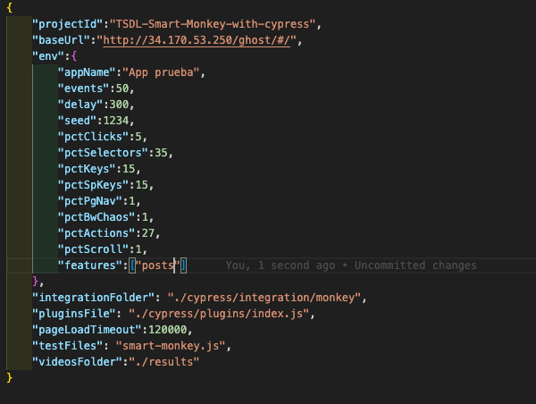
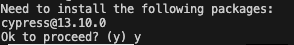

# Instalar dependencias
`npm install`

# Escribir el archivo smart-monkey-config.json

La herramienta se programo para que aislen ejecución de pruebas de reconocimiento únicamente para algun contexto dado. En este caso, el contexto se da por la feature seleccionada. La herramienta dispone de las siguientes fueatures ["posts","pages","tag","members"].

Abra el archivo `smart-monkey-config.json` y el atributo features de env, cambielo por la feature que desee probar. Mantenga los corchetes cuadrados y las comillas

# Ejecutar Cypress monkey
`npx cypress run -C smart-monkey-config.json -b chrome --headed`

En dado caso de que no tenga instalado cypress y se vea en el log, acepte la instalación y porsiga

